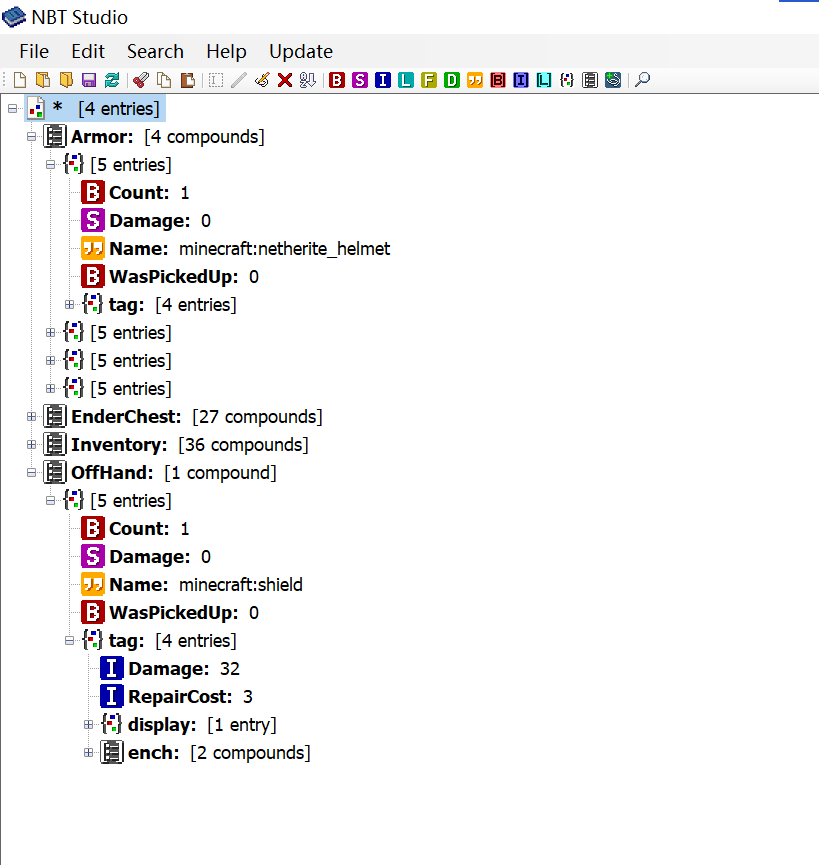

# LiteXLoader - NBT 文档

> **NBT（二进制命名标签**，**N**amed **B**inary **T**ags**）** 格式为Minecraft中用于向文件中存储数据的一种存储格式。   
> NBT格式以树形结构并配以许多*标签* 的形式存储数据。所有的标签都有一个独立的ID和名称。
>
> --- Minecraft Wiki

这里为脚本提供了操作 **NBT** 数据类型的能力。 **NBT** 接口的支持，极大的提高了游戏的可扩展性

游戏中，使用被称为 **NBT标签 **的节点来标识一项NBT数据。NBT标签中可以储存普通数据、List、Compound 等多种数据类型。   
LXL数据类型与NBT数据类型的对照如下：

| NBT数据类型           | 对应的LXL数据类型 | 类型说明（来自MC Wiki）                      |
| --------------------- | ----------------- | -------------------------------------------- |
| `End`                 | `Null`            | 用于标记标签的结尾                           |
| `Byte`                | `Integer`         | 有符号字节 、布尔值                          |
| `Short`  `Int` `Long` | `Integer`         | 有符号短整型、整形和长整型                   |
| `Float`  `Double`     | `Float`           | 单精度浮点数和双精度浮点数                   |
| `ByteArray`           | `ByteBuffer`      | 字节数组                                     |
| `String`              | `String`          | UTF-8 字符串                                 |
| `List`                | `Array`           | 标签列表                                     |
| `Compound`            | `Object`（类似）  | 一系列完整的标签信息，包括ID、名称以及负载等 |

 

在LXL的NBT接口中，对上述内容进行了很大的简化  
LXL使用 `NbtValue`、`NbtList`、`NbtCompound`三种数据类型来共同表示NBT数据标签。我们统称他们为「NBT对象」。

| 类型名        | 对应的NBT数据类型                                            | 类型说明                      |
| ------------- | ------------------------------------------------------------ | ----------------------------- |
| `NbtValue`    | `End` `Byte` `Short` `Int` `Long`  `Float` `Double` `ByteArray` `String` | 储存只有值的简单结构          |
| `NbtList`     | `List`                                                       | 储存类似数组 / 列表的复杂结构 |
| `NbtCompound` | `Compound`                                                   | 储存类似对象 / 表的复杂结构   |

三种数据类型有略微不同的使用接口。下面对他们作分别介绍

 

## 🥽 获取一个 NBT 对象

### 从事件或API获取

通过调用实体、方块、物品API中**返回NBT对象**的函数，来获取对应的NBT对象。  
详见实体、物品、方块等各自的文档说明

### 创建新的NBT对象

根据你提供的数据，来创建新的NBT对象  
`NBT.createTag(type[,data])`

- 参数：
  - type : `Enum`  
    你要创建的NBT对象的数据类型。可选值如下  
    `NBT.End`  `NBT.Byte`  `NBT.Short`  `NBT.Int`  `NBT.Long`   
    `NBT.Float ` `NBT.Double ` `NBT.ByteArray`  `NBT.String`  
    `NBT.List`  `NBT.Compound`
  - data: `任意类型`（可选参数）  
    根据你要创建的对象类型设置初始数据  
    如创建`NBT.Float`类型的 NBT 对象，那你需要传入一个`Float`类型的值  
- 返回值：生成的NBT对象
- 返回值类型：`NbtValue`或`NbtList` 或 `NbtCompound`，取决于你选择的数据类型
  - 如返回值为 `Null` 则表示获取失败

### 从 SNBT  字符串生成 NBT 对象

SNBT字符串中必须包含一个完整的Compound。通过此接口，根据其生成对应的NBT对象

`NBT.parseSNBT(snbt)`  

- 参数：
  - snbt : `String`  
    你要解析的SNBT字符串
- 返回值：生成的NBT对象
- 返回值类型：`NbtCompound`
  - 如返回值为 `Null` 则表示解析失败

 

### 从二进制 NBT 数据生成 NBT 对象

二进制 NBT 数据中必须包含一个完整的Compound。通过此接口，根据其生成对应的NBT对象

`NBT.parseBinaryNBT(nbt)`  

- 参数：
  - nbt : `ByteBuffer`  
    你要解析的二进制 NBT 数据
- 返回值：生成的NBT对象
- 返回值类型：`NbtCompound`
  - 如返回值为 `Null` 则表示解析失败

 

## 🎈  NBT 对象通用接口

每一个 NBT 对象都包含一些可以执行的成员函数（成员方法）。使用这些函数来读写NBT标签中的数据  
对于任何种类的NBT对象，都有下面这些通用的接口。以名为`nbt`的NBT对象为例：

#### 获取NBT对象储存的数据类型

`nbt.getType()`

- 返回值：此NBT对象储存的数据类型
- 返回值类型：`Enum`

可能的返回值有：`NBT.End` `NBT.Byte` `NBT.Short` `NBT.Int` `NBT.Long`   
`NBT.Float` `NBT.Double` `NBT.ByteArray` `NBT.String`  
`NBT.List` `NBT.Compound`

 

#### 将NBT对象转换为字符串

`nbt.toString([space])`

- 参数
  - space : `Integer`  
    （可选参数）如果要格式化输出的字符串，则传入此参数  
    代表每个缩进的空格数量，这样生成的字符串更适合人阅读  
    此参数默认为0，即不对输出字符串进行格式化
- 返回值：对应的Json字符串
- 返回值类型：`String`

提示：如果这个NBT对象储存的是`List`或者`Compound`类型，将递归展开为`Array`或`Object`  
如果这个NBT对象储存的是`ByteArray`类型，输出的字节串将先进行base64编码后再输出

> 上述函数输出的字符串符合Json标准格式，但是无法进行反序列化。  
> 如果有反序列化的需求，请使用下方的SNBT接口

 

#### NBT对象序列化为SNBT

`nbt.toSNBT()`

- 返回值：对应的SNBT字符串
- 返回值类型：`String`

> 只有完整的顶层Compound标签可以被转换为SNBT

 

#### NBT对象序列化为二进制NBT

`nbt.toBinaryNBT()`

- 返回值：对应的二进制NBT数据
- 返回值类型：`ByteBuffer`

> 只有完整的顶层Compound标签可以被转换为二进制NBT

 

#### 示例：使用图形化编辑器处理 NBT 数据

可以使用开源的 NBT Explorer，或其他 NBT 工具来**直观地**查看和修改 SNBT、二进制 NBT 数据  
如图：

 

#### 清理此NBT对象

`nbt.destroy()`

- 返回值：是否成功清理
- 返回值类型：`Boolean`

注意，只有根Compound标签可以被清理，而且，请谨慎使用此函数，不当的使用将会造成服务器崩溃  
合适的清理有助于解决内存占用问题。在清理完后，请千万不要再使用此NBT对象和他的所有子对象

 

## 📙 NbtValue - 具体数据

一个`NbtValue`对象，储存只有值的简单结构。  
通过`NbtValue`对象，可以对一个NBT Tag的具体值进行读取和修改。  
对于某个一个`NbtValue`类型的对象`value`，有如下这些接口

#### 设置对象的数据

`value.set(data)`

- 参数：
  - data: `任意类型`  
    根据这个NBT对象的数据类型，写入对应类型的数据  
    如对于一个`Float`类型的 NBT 对象，你需要传入一个`Float`类型的值
- 返回值：是否成功写入
- 返回值类型：`Boolean`

 

#### 读取对象的数据

`value.get()`

- 返回值：对象中储存的数据
- 返回值类型：`任意类型`，以对象储存的数据类型为准

 